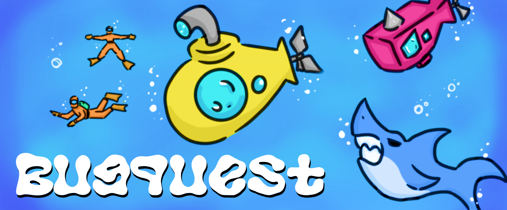

## BUGQUEST | Remasterización del juego para atari 2600 "Seaquest".

  

### ELECTIVA 5 / SECCIÓN 1
### Integrantes:
- Eduardo Hurtado.
- Barbara Correa.

        
        <h3 style="padding-bottom: 0; margin-bottom: 0;">Bugquest (Seaquest Remake)</h3>
        <a href="https://bcrandom306.itch.io/bugquest-seaquest-remake"
        style="
            display: inline-block;
            padding: 0.75em 1.5em;
            background-color: #6193ff;
            color: #fff;
            text-decoration: none;
            border-radius: 6px;
            font-weight: bold;
            box-shadow: 0 4px 6px rgba(0, 0, 0, 0.1);
            transition: background-color 0.3s ease;
        ">
            Disponible en Itch.io
        </a>

